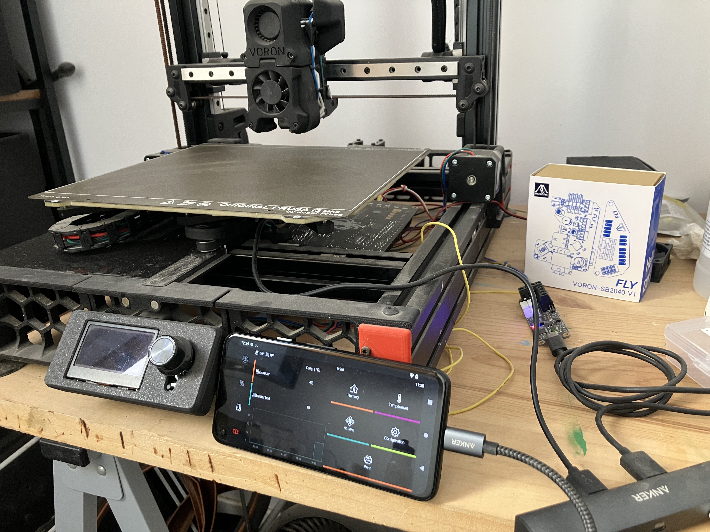

# QuineOS - 3D Printer Control Operating System

QuineOS is a single purpose operating system based on Android and LineageOS, specifically designed for 3D printer control. QuineOS leverages the power of Klipper, Mainsail, and Moonraker to provide a seamless 3D printing experience with superior control capabilities. One of the main goals of quineOS is to repurpose old, unused Android phones that would otherwise be thrown away, giving them new life as 3D printer controllers.



## Features

- **Klipper**: High-performance firmware that runs on the printer's control board, providing advanced control algorithms and communication protocols.
- **Mainsail**: A modern, responsive, and user-friendly web interface for managing Klipper-based 3D printers.
- **Moonraker**: A RESTful API server that facilitates communication between Mainsail and Klipper.
- **KlipperScreen**: A touchscreen interface for controlling your 3D printer directly from the Android phones touch screen.
- **Remote VNC Access**: Access and control your 3D printer remotely using Tailscale, a secure and simple VNC solution.
- **CANbus Support**: QuineOS supports CANbus controller boards out of the box for easy integration with advanced printer configurations.
- **Input Shaping and Pressure Advance**: Enhanced print quality and control with built-in support for input shaping and pressure advance algorithms.

## Get Started

### Building QuineOS

To build QuineOS, first clone this repository and the cicd builder repo:
```bash
git clone https://github.com/projectquine/quineOS.git
git clone https://github.com/projectquine/docker-lineage-cicd.git
```

Now build the docker image for the build system using:
```
cd docker-lineage-cicd
sudo docker build -t quineos-cicd .
```

Once the docker build has completed, change directory into `quineOS` folder and run the Docker command below to build the operating system for your target device. In this example it is Google Pixel 4a, codename `sunfish`:

```bash
sudo docker run -d \
    -e "BRANCH_NAME=lineage-20.0" \
    -e "DEVICE_LIST=sunfish" \
    -e "SIGNATURE_SPOOFING=restricted" \
    -e "WITH_GMS=true" \
    -e "CUSTOM_PACKAGES=Termux TermuxBoot TermuxX11 Magisk Tailscale DroidVnc QuineLauncher QuineCamera" \
    -v "$(pwd)/src:/srv/src" \
    -v "$(pwd)/zips:/srv/zips" \
    -v "$(pwd)/logs:/srv/logs" \
    -v "$(pwd)/cache:/srv/ccache" \
    -v "$(pwd)/manifests:/srv/local_manifests" \
    quineos-cicd
```

The build process may take a while, depending on your system's resources (recommended: 16 cores with 64GB Ram and at least 300+ GB of disk). Once the build is complete, you can find the generated images in the `zips` directory.

## Installation
To install quineOS, first visit the [LineageOS Devices website](https://wiki.lineageos.org/devices/) and follow the flashing instructions for your specific device. Once you have prepared your device according to the instructions, flash the quineOS image generated in the previous step.

## Contributing
quineOS is an open-source project, and we welcome contributions from the community. Whether you're a developer, designer, or 3D printing enthusiast, there are many ways you can contribute:

* Report bugs or request features by opening an [issue on the GitHub repository](https://github.com/projectquine/quineOS/issues).
* Submit improvements or bug fixes via pull requests.
* Help improve the documentation or write tutorials.
* Share your experience and help others in the community.

By contributing to quineOS, you'll be a part of a passionate community working together to push the boundaries of 3D printing technology and promote the repurposing of old Android devices.

## Join the Community
Get involved in the quineOS community by following us on twitter: [@ProjectQuine](https://twitter.com/ProjectQuine) or substack: [projectquine.substack.com](https://projectquine.substack.com/)
