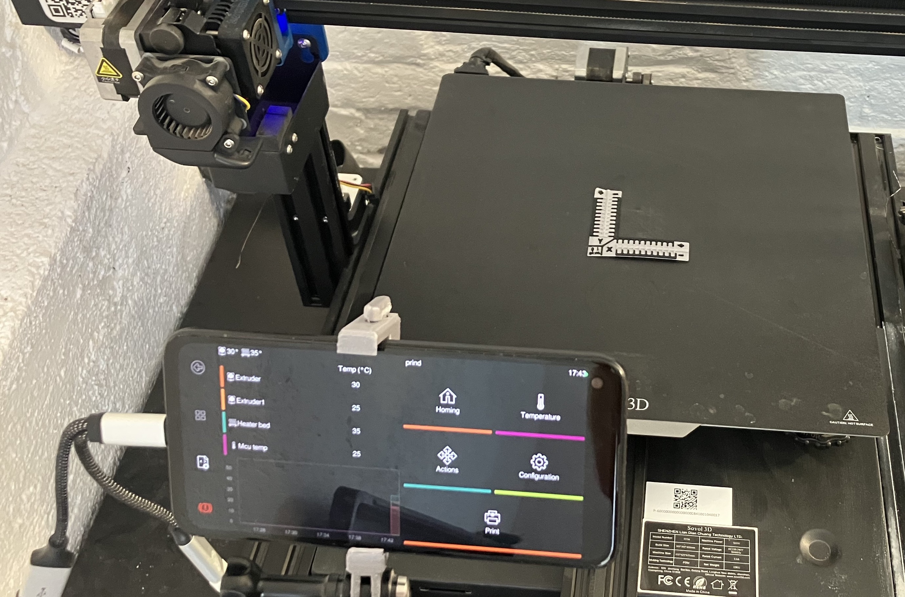

# Introduction

QuineOS is a single-purpose Android operating system designed specifically for 3D printers. By leveraging the power and flexibility of LineageOS, QuineOS brings new life to old Android smartphones, transforming them into powerful and customizable 3D printer controllers. Featuring a robust, open-source software stack and hackable architecture, QuineOS is the ultimate solution for 3D printing enthusiasts looking to make the most out of their devices and elevate their 3D printing experience.

## Overview of QuineOS

At the heart of QuineOS is the commitment to breathe new life into the Android smartphones that are collecting dust in drawers around the world. By supporting any device that LineageOS is compatible with, QuineOS offers a unique opportunity for users to repurpose old hardware into state-of-the-art 3D printer controllers.

QuineOS combines the best of open-source technology, taking advantage of a unique combination of Docker and Android. It offers a fully integrated Klipper stack out of the box. With Klipper, Moonraker, Mainsail, and KlipperScreen working in harmony, you can connect to your printer MCU boards via USB serial or CANbus giving you the best 3D print setup almost for free. Since it's all open and documented, you can easily install additional Android apps or Docker containers to expand the functionality of a QuineOS-powered 3D printer.

## Features and benefits

### Fully klipper stack

The Core of QuineOS is a set of [Docker containers](https://www.docker.com/resources/what-container/) running an opininated Klipper stack. Currently, the stack is setup with [Mainsail](https://docs.mainsail.xyz/) as the web frontend, [KlipperScreen](https://klipperscreen.readthedocs.io/en/latest/) as the on Phone interface, [Moonraker](https://moonraker.readthedocs.io/en/latest/) for the API and [Klipper](https://www.klipper3d.org/) obviously for the print controller. There are also options to swap out the web frontend for Octoprint or Fluidd but this has not been fully tested.

### Secure remote connectivity and control

QuineOS offers a myriad of connection options. For remote access, it includes [Tailscale](https://tailscale.com/) VPN preinstalled and this coupled with a VNC app allows nearly complete secure remote control of the system. Locally, QuineOS also offers up a SSH connection on port `8022` and additionally sets up mDNS so that your printer is discoverable as `android.local` in the local network.

### Supported devices

Currently QuineOS has only been ported to the following devices:
- Google Pixel 4a (sunfish)
- OnePlus 5 (dumpling)

But it should be fairly quick and easy to port and build for any other phones that currently have support for LineageOS 20.0. If you want your phone supported, drop an issue on the issues list here: https://github.com/projectquine/quineOS/issues

### Canbus and serial control board support

QuineOS sets up and configures serial and CANbus support so that it works out of the box. Currently known tested boards are:

#### Serial:

- [BigTreeTech Octopus v1.1](https://biqu.equipment/collections/control-board/products/bigtreetech-octopus-v1-1?variant=39812758765666)
- [Sovol SV04 Idex printer](https://sovol3d.com/products/sv04) which is based on the `Creality "v5.2.1" board`

#### CANbus:

- [Mellow Fly VORON-SB2040](https://github.com/Mellow-3D/Fly-SB2040)
- [HUVUD toolboard](https://github.com/bondus/KlipperToolboard)
- [BIGTREETECH EBB 36/42 Can Bus U2C V2.1](https://biqu.equipment/products/bigtreetech-ebb-36-42-can-bus-for-connecting-klipper-expansion-device?_pos=2&_sid=d9e78c1b7&_ss=r&variant=39762747949154) for USB to CANbus.
- [Mellow FLY-UTOC-1](https://es.aliexpress.com/i/1005004687165673.html?gatewayAdapt=glo2esp) for USB to CANbus.
- [RPI pico (RP2040)](https://www.raspberrypi.com/products/raspberry-pi-pico/), but this needs an addtional CAN transceiver board like [this](https://www.waveshare.com/sn65hvd230-can-board.htm). 

## Limitations and known issues

- On some 4.4 kernel devices containers only will run with `--ipc=host`
- Occasionally docker daemon will not start correctly as it can't connect to the runc socket, reboot should fix that. **[we are actively debugging]**
- klipperScreen starts in wrong orientation or only uses half screen. Need to run `docker restart prind-klipperscreen-1`
- android.local services fail sometime after boot. **[we are actively debugging]**
- Currently the OS images are not signed but this will be done once out of ALPHA state.
- Occasionally when running a print and full VNC remote session the phone will hit a over heating warning and throttle its CPU to compensate.
- Constantly charging a phone battery can be a risk to destroying the battery, so we recommend a setup which would periodically stop the charger for the phone.